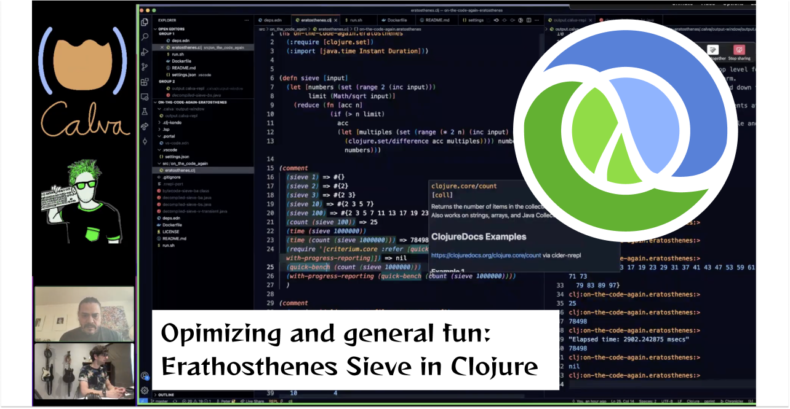

# Clojure Eratosthenes with On The Code Again and PEZ 

Viewer material for the live streaming and recording of a different aspects of prime sieving using Clojure. Including performance tuning.

Over the two live streaming sessions we managed to iterate on our base implementation (0) four times and improve performance from 2-3 sieving passes of the first million numbers in five seconds, to nearly 10K passes. Try the `./run.sh` script in this branch and it will give you something like:

```
0: Passes: 3, Time: 6.551765000, Avg: 2.1839216, Limit: 1000000, Count: 78498, Valid: True
1: Passes: 58, Time: 5.084850000, Avg: 0.08766983, Limit: 1000000, Count: 78498, Valid: True
2: Passes: 211, Time: 5.001530000, Avg: 0.023703933, Limit: 1000000, Count: 78498, Valid: True
3: Passes: 5969, Time: 5.001468000, Avg: 8.379072E-4, Limit: 1000000, Count: 78498, Valid: True
4: Passes: 9057, Time: 5.001214000, Avg: 5.521932E-4, Limit: 1000000, Count: 421502, Valid: False
```

<a href="https://youtube.com/playlist?list=PLPb7X_9OOo7pR1CEcR2dA1CfBj8pYta6L">

</a>

Live Streams (now videos):
* Feb 2, 2022: https://www.youtube.com/watch?v=tRPKSXullYs
* Feb 9, 2022: https://www.youtube.com/watch?v=T_wuPrHIupU

Videos:
* Jan 25, 2022:[ On the Code Again - The Sieve of Erathostenes](https://www.youtube.com/watch?v=jLJgqG3zJ04)


Some more resources:

* [On The Code Again on YouTube](https://www.youtube.com/c/onthecodeagain)
* [CalvaTV (also YouTube)](https://www.youtube.com/c/CalvaTV/) - [Eratosthenes playlist](https://youtube.com/playlist?list=PLPb7X_9OOo7pR1CEcR2dA1CfBj8pYta6L)
* [Eratosthenes Algorithm](https://en.wikipedia.org/wiki/Eratosthenes)
* [David Plummer's Programming Languages Drag Racing Video](https://www.youtube.com/watch?v=D3h62rgewZM)
* [Drag Racing Leaderboard](https://plummerssoftwarellc.github.io/PrimeView/)
* [PEZ's Clojure drag-racing solutions](https://github.com/PlummersSoftwareLLC/Primes/tree/drag-race/PrimeClojure/solution_3)
* [Clojure Goes Fast](http://clojure-goes-fast.com)
* Calva Home: https://calva.io

## What's included in the project

You will find a project prepared for starting to experimenting with the Sieve of Eratosthenes (or any alorithm, if you like). It's mainly built for being used from the REPL, but there are some facilities for running it as a script as well, included running in Docker.

The project comes equipped with some really good libraries for optimizing Clojure code:

* [Criterium]() for measuring performance. Awesome [blog article here](http://clojure-goes-fast.com/blog/benchmarking-tool-criterium/)
* [clj-async-profiler](https://github.com/clojure-goes-fast/clj-async-profiler) for profiling where time is spent in your code. [Introduced here](http://clojure-goes-fast.com/blog/profiling-tool-async-profiler/).
* [clj-java-decompiler](https://github.com/clojure-goes-fast/clj-java-decompiler) for inspecting the bytecode generated by the Clojure Compiler and also for decompiling it to Java. [Quick Demo with Calva](https://www.youtube.com/watch?v=sPP4LCpBic8)

There are also some Calva [custom commands](https://calva.io/custom-commands/) preconfigured, for using the decompiler smoothly.

Check these branches for versions of the sieving code that might have been featured in some live stream or video.

* `live-stream-1`: [Live stream Feb 2, 2022](https://github.com/PEZ/on-the-code-again-eratosthenes/tree/live-stream-1)
* `live-stream-2`: [Live stream Feb 2, 2022](https://github.com/PEZ/on-the-code-again-eratosthenes/tree/live-stream-2)

### Using it the Clojure way (from the REPL)

Generally when developing you should start the REPL with the aliases: `:benchmark`, `:decompiler`, and `:profiler`. Then just hack away. Watching some of the videos linked above might be a good start.

The only Clojure file so far is: `src/on_the_code_again/eratosthenes.clj`

There are two ways to check performance of a sieve function prepared.

1. A [Rich Comment](https://calva.io/rich-comments/) block where you can require and run Criterium benchmarks.
2. A `run` function that runs the drag-race for a given sieve function. At the bottom of the file there another Rich comment block where you can pull the starting-gun trigger.

To easily run a particular sieve function drag-race, you'll need to add a small config to the `confs`. Particularly you might need to add a `:count` function, depending on the nature of the sieve returned from the sieving function.

### Command line and Docker

To run the drag-race from the command line simply:

```sh
$ ./run.sh [<runs>]
```

Runs defaults to `1`. Check the script and you'll see how to add more seiving functions to be run.

Sample output:

```
run: 0
Passes: 3, Time: 7.087124000, Avg: 2.3623748, Limit: 1000000, Count: 78498, Valid: True
set;3;7.087124000;1;algorithm=base,faithful=yes,bits=?
Passes: 58, Time: 5.003915000, Avg: 0.08627439, Limit: 1000000, Count: 78498, Valid: True
vector;58;5.003915000;1;algorithm=base,faithful=yes,bits=1
```

Follow the drag-racing links above to find out what some of that means.

To run it via docker, first build it, then run it (duh). Here's a one-liner for your convenience:

```sh
docker build -t otca-sieve-clojure  . && docker run --rm -it otca-sieve-clojure
```

The docker script will run `run.sh` without arguments, meaning it will run the drag-race once.

If you run it on your machine(s) with `run.sh` and in Docker, you might notice that performance can vary quite a lot between environments. You might also notice that sometimes it gets totally weird, some 50% of the runs are performing way outside any expected deviations. If you find this mysterious, [welcome to the club](https://twitter.com/pappapez/status/1486339516520673283).

## Thanks to my sponsors

The reason I can spend focused time on Wednesdays with Calva and stuff like this is because my employer, [Agical](https://agical.se), pays me a full salary, while letting me spend 20% of my time on my open source things.

<a href="https://blog.agical.se/en">

</a>

The reason my family allows me to spend so much of my free time on open source is because sponsors [donate to me via GitHub Sponsors](https://github.com/sponsors/PEZ). This brings in some extra money to the household which more than cover the costs the projects incure. The surplus I mostly spend on presents to my family and to make fun things together with them.

See the [Calva Sponsors](https://calva.io/sponsors/) page for how to sponsor Calva and other open source actovities of me and [Brandon Ringe](https://github.com).

## Licence

MIT.

(But really, all I wish is that you paricipate in the movement where we stay kind to the all the nice people we interact with - Be nice!.)

## Happy seiving! ❤️

I can recommend this activity. It's fun and I have learnt a lot about Clojure with it. I also feel the need to warn about the rabbit hole that it is. Wondering if I will ever return. 😄

Please don't hesitate to send PRs against this repo, correcting typos, improving code or scripts or whatever.